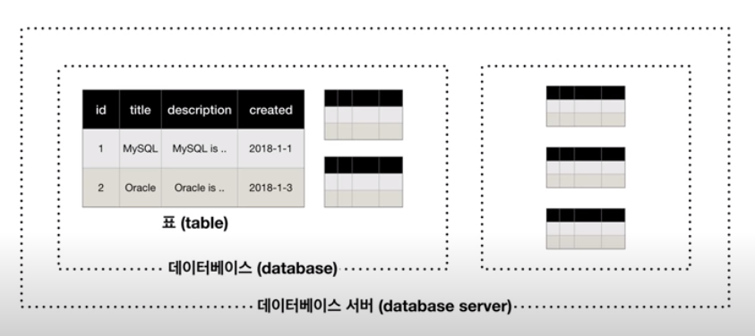
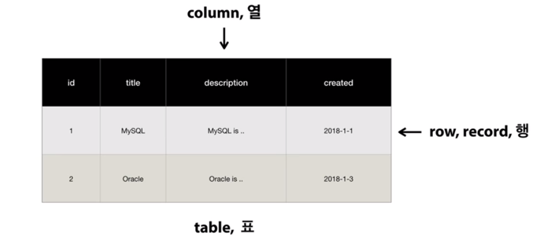

# Mysql

## 0. SQL

- Structured Query Language
- 데이터베이스와 상호작용하기 위한 언어

## 1. Mysql 구조



- Table: 데이터의 기본 저장 구조
- Schema(Database): 연관된 Table의 집합, 파일의 폴더와 유사
- Database Server: 스키마들을 저장 및 운영하는 프로그램

## 2. 기본 명령어

### Database Server 접속

```shell
mysql -u {username} -p
```

- `-p`: 뒤에 비밀번호를 입력하면 되지만 보안상의 이유로 비밀번호를 입력하지 않고 `-p`만 입력하면 비밀번호를 입력하라는 메시지가 나온다.

### Database 생성

```mysql
CREATE DATABASE {database_name};
```

### Database 삭제

```mysql
DROP DATABASE {database_name};
```

### Database 확인

```mysql
SHOW DATABASES;
```

### Database 사용

```mysql
USE {database_name};
```

## 3. Table



### Table 생성

```mysql
CREATE TABLE {table_name} (
    {column_name} {data_type} {option},
    {column_name} {data_type} {option},
    ...
);
```

```mysql
CREATE TABLE topic (
    id INT(11) NOT NULL AUTO_INCREMENT,
    title VARCHAR(100) NOT NULL,
    description TEXT NULL,
    created DATETIME NOT NULL,
    author VARCHAR(30) NULL,
    profile VARCHAR(100) NULL,
    PRIMARY KEY(id)
);
```

- `INT(11)` : 보여지는 값의 길이를 11로 지정
- `NOT NULL` : 값이 비어있으면 안된다.
- `AUTO_INCREMENT` : 자동으로 숫자를 증가시킨다.
- `VARCHAR(100)` : 100글자만 저장하고 넘어가는 값은 삭제
- `TEXT` : 글자수 제한이 65,535자
- `NULL` : 값이 비어있어도 된다.
- `DATETIME` : 날짜와 시간을 저장하는 데이터 타입
- `PRIMARY KEY` : 기본키로 설정, 중복 방지

## 4. CRUD

- Create, Read, Update, Delete

### Create

```mysql
INSERT INTO {table_name} ({column_name}, ...) VALUES ({value}, ...);
```

### Read

```mysql
SELECT {column_name}, ... FROM {table_name};
```

#### 조건문(WHERE)

```mysql
SELECT id,title,author FROM topic WHERE author='myko';
```

#### 정렬(ORDER BY)

```mysql
SELECT id,title,author FROM topic ORDER BY id DESC;
```

- `ASC` : 오름차순, 생략해도 오름차순
- `DESC` : 내림차순

#### 개수 제한(LIMIT)

```mysql
SELECT id,title,author FROM topic ORDER BY id DESC LIMIT 2;
```

- 상위 2개만 출력

```mysql
SELECT id,title,author FROM topic ORDER BY id DESC LIMIT 0,2;
```

- 0번째부터 2개 출력

### Update

```mysql
UPDATE {table_name} SET {column_name}={value}, ... WHERE {condition};
```

- `WHERE`를 생략하면 모든 데이터가 변경된다.

### Delete

```mysql
DELETE FROM {table_name} WHERE {condition};
```

- `WHERE`를 생략하면 모든 데이터가 삭제된다.

## 5. 관계형 데이터베이스

